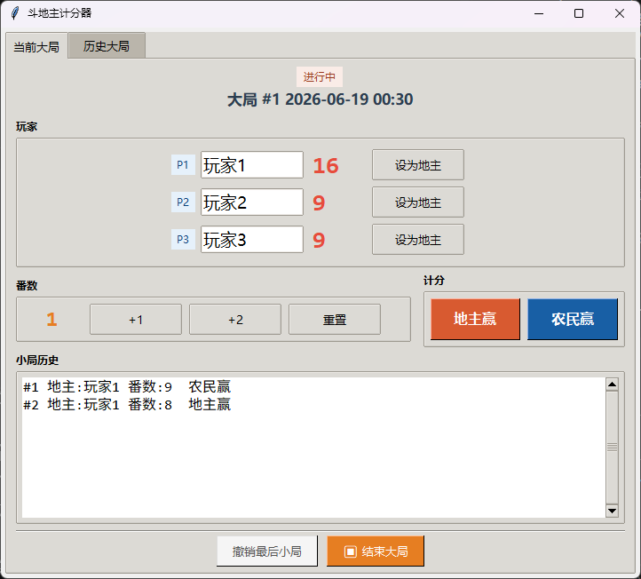
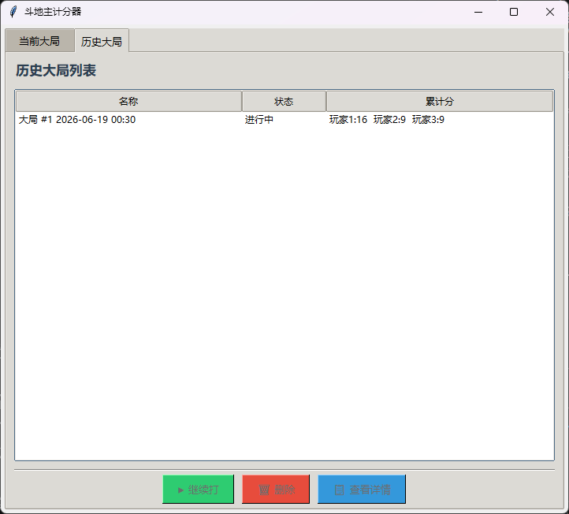

# Doudizhu Score Calculator

> English | [中文](./README.md)

A Python Tkinter-based score calculator for Doudizhu (Chinese poker), featuring a two-level game structure (big games/small rounds), file persistence, and history management.

---

## Features

- 🎴 **Three-Player Scoring** — Editable player names with cumulative scores displayed in real-time
- 🔢 **Multiplier Adjustment** — +1 / +2 / Reset multiplier
- 👑 **Landlord Designation** — Toggle landlord role with 👑 indicator on button
- 🎯 **Scoring Logic** — Landlord wins (+multiplier ×2), Farmers win (each farmer +multiplier ×1)
- ↩️ **Undo Round** — Remove last small round record with automatic score rollback
- 📊 **Game Management** — Start, finish, resume, and delete big games
- 📋 **History View** — View complete game details with per-round score changes in popup
- 💾 **File Persistence** — Auto-saves to `games.json`, loads automatically on startup

## Requirements

- Python 3.7+
- tkinter (built-in)

## Quick Start

```bash
python main.py
```

Or double-click `main.py` to run directly.

## Screenshots

### Current Game Page



- Header displays game name and status (In Progress / Not Started)
- Player section: Editable names, real-time scores, click "Set as Landlord" to toggle role
- Multiplier section: +1/+2/Reset, adjust current round multiplier
- Scoring section: Landlord Win (+multiplier×2) / Farmer Win (each farmer+multiplier×1)
- Round history: Records each round's landlord, multiplier, and winner
- Bottom controls: Undo last round, Start/End game

### History Game Page



- List view showing all games (Name, Status, Cumulative Score)
- Select a finished game to Resume, Delete, or View Details
- Double-click a list item to view details popup

## Instructions

| Action | Location | Description |
|--------|----------|-------------|
| Edit Name | Page 1 | Click input to modify, auto-saves on focus loss |
| Set Landlord | Page 1 | Click button next to player to toggle |
| Score | Page 1 | After selecting landlord, click "Landlord Win" / "Farmer Win" |
| Undo Round | Page 1 | Click "Undo Last Round" button |
| Start/End Game | Page 1 | Button at bottom toggles between states |
| Resume Game | Page 2 | Select a finished game → Click "Resume" |
| Delete Game | Page 2 | Select a finished game → Click "Delete" |
| View Details | Page 2 | Select a game → Click "View Details" or double-click |

## Project Structure

```
score_calculate/
├── main.py           # Entry point
├── models.py         # Data models (BigGame, SmallRound)
├── persistence.py    # File persistence
├── ui.py             # Tkinter GUI
├── demand.md         # Original requirements
├── games.json        # Auto-generated game data
├── README.md         # Chinese documentation
└── README.en.md      # English documentation
```

## License

MIT
